# Protocol: Sequential Handoff Protocol

## 1. Overview & Objective
This protocol governs the communication and artifact generation lifecycle between agent roles. To eliminate context bleed and preserve an immutable, deterministic audit trail of engineering decisions, roles communicate strictly through written markdown artifacts.

## 2. Storage Location & Directory Structure
* All handoff artifacts for a given branch must reside in `.agent_handoffs/<branch_name>/`.
* The folder naming must match the active working branch name (e.g., `.agent_handoffs/feature/modular-agent-roles/`).
* Retention policy: Handoff folders are permanently retained for historical auditability unless explicitly commanded for deletion by the user after a successful merge.

## 3. Artifact Chaining Contract
Each role reads the artifact created by the immediately preceding role, executes its scoped mandate, produces its own numbered artifact, and passes control to the designated successor:

```mermaid
flowchart LR
    User["User Prompt"] --> Orch0["Orchestrator<br/>(0_context.md)"]
    Orch0 --> Plan["Planner<br/>(1_plan.md)"]
    Plan --> Arch["Architect<br/>(2_architecture.md)"]
    Arch --> Dev["Senior Dev<br/>(3_implementation.md)"]
    Dev --> Rev["Code Reviewer<br/>(4_review.md)"]
    Rev -->|Fixes Requested| Dev
    Rev -->|Approved| Doc["Document Writer<br/>(5_documentation.md)"]
    Doc --> OrchFinal["Orchestrator<br/>(PR & User Consent)"]
```

## 4. Handoff Step Matrix
| Sequence | Role | Input Artifact | Output Artifact | Primary Action |
|---|---|---|---|---|
| 0 | Orchestrator | User Prompt | `0_context.md` | Intercept request, verify clean branch from `dev`, define scope |
| 1 | Planner | `0_context.md` | `1_plan.md` | Ingest context, inspect repo, formulate numbered plan |
| 2 | Architect | `1_plan.md` | `2_architecture.md` | Ingest plan, design schemas, contracts, specs, file trees |
| 3 | Senior Dev | `2_architecture.md` | `3_implementation.md` | Ingest architecture, write code, run verification |
| 4 | Code Reviewer | `2_architecture.md`, `3_implementation.md` | `4_review.md` | Ingest specs and diff, audit quality/logic, issue verdict |
| 5 | Document Writer | `4_review.md` (Approved) | `5_documentation.md` | Ingest all artifacts, update docs/ADRs, open PR targeting `dev` |
| 6 | Orchestrator | `5_documentation.md` | Final Report | Halt for explicit user consent before merge |
