# Protocol: Sequential Handoff Protocol

## 1. Overview & Objective
This protocol governs the communication and artifact generation lifecycle between agent roles. To eliminate context bleed, minimize token consumption, and preserve an immutable, deterministic audit trail of engineering decisions, roles communicate strictly through written markdown artifacts.

## 2. Storage Location & Directory Structure
* All handoff artifacts for a given branch must reside in `.agent_handoffs/<branch_name>/`.
* The folder naming must match the active working branch name (e.g., `.agent_handoffs/feature/token-optimization/`).
* Retention policy: Handoff folders are permanently retained for historical auditability unless explicitly commanded for deletion by the user after a successful merge.

## 3. Single-Hop Delta Handoff Contract
To prevent token bloat and context window saturation, agents adhere to a strict **Single-Hop Delta Handoff**:
* Each role consumes **only the immediate predecessor's artifact**.
* Agents must **NOT** load the cumulative historical chain of artifacts unless explicitly commanded by the user.
* Predecessor roles summarize relevant context into their scoped artifact; successors rely on this delta rather than re-reading prior stages.

```mermaid
flowchart LR
    User["User Prompt"] --> Orch0["Orchestrator<br/>(0_context.md)"]
    Orch0 --> Intake["Intake Gate<br/>(1_intake_gate.md)"]
    Intake -->|Green / Cleared| Arch["Architect<br/>(2_architecture.md)"]
    Arch --> Dev["Senior Dev<br/>(3_implementation.md)"]
    Dev --> Rev["Code Reviewer<br/>(4_review.md)"]
    Rev -->|Fixes Requested| Dev
    Rev -->|Approved| Accept["Acceptance Gate<br/>(5_acceptance_gate.md)"]
    Accept -->|Defects Found| Dev
    Accept -->|Accepted| Doc["Document Writer<br/>(6_documentation.md)"]
    Doc --> OrchFinal["Orchestrator<br/>(PR & User Consent)"]
```

## 4. Handoff Step Matrix
| Sequence | Role | Input Artifact | Output Artifact | Primary Action |
|---|---|---|---|---|
| 0 | Orchestrator | User Prompt | `0_context.md` | Intercept request, verify clean branch from `dev`, define scope boundaries |
| 1 | Intake Gatekeeper | `0_context.md` | `1_intake_gate.md` | Ingest context, inspect `src/**`, evaluate feasibility, assign Green/Yellow/Red verdict |
| 2 | Architect | `1_intake_gate.md` | `2_architecture.md` | Ingest plan & constraints, design schemas, contracts, specs, file trees |
| 3 | Senior Dev | `2_architecture.md` | `3_implementation.md` | Ingest architecture, write code, run verification |
| 4 | Code Reviewer | `3_implementation.md` | `4_review.md` | Ingest implementation summary & `git diff`, audit technical quality, issue verdict |
| 5 | Acceptance Gatekeeper | `1_intake_gate.md` & `4_review.md` | `5_acceptance_gate.md` | Verify PO acceptance criteria, Bulgarian UI, and user flows against implementation |
| 6 | Document Writer | `5_acceptance_gate.md` (Accepted) | `6_documentation.md` | Ingest acceptance, update docs/ADRs, open PR targeting `dev` |
| 7 | Orchestrator | `6_documentation.md` | Final Report | Review verified PR, present to PO, halt for explicit user consent before merge |

## 5. Artifact Size Ceilings & Token Budgets
Every handoff artifact must strictly observe size ceilings to prevent runaway context expansion:

| Artifact | Role Owner | Target Token Ceiling | Max Word Count (~approx) | Scope & Focus |
|---|---|---|---|---|
| `0_context.md` | Orchestrator | 1,500 | 1,100 | User request interpretation, scope boundaries, Git state |
| `1_intake_gate.md` | Intake Gatekeeper | 2,000 | 1,500 | Feasibility verdict (🟢/🟡/🔴), acceptance criteria, technical findings |
| `2_architecture.md` | Architect | 3,000 | 2,250 | System schemas, API contracts, file tree, implementation specs |
| `3_implementation.md`| Senior Dev | 2,500 | 1,800 | Change summary, modified file links, compliance proofs |
| `4_review.md` | Code Reviewer | 1,500 | 1,100 | Diff checklist, finding analysis, formal verdict |
| `5_acceptance_gate.md` | Acceptance Gatekeeper | 2,000 | 1,500 | Business criteria verification matrix, Bulgarian UI audit, UAT flow checks |
| `6_documentation.md` | Document Writer | 2,000 | 1,500 | Docs updates log, ADR summary, PR metadata |

## 6. Lean Artifact Schema Rules
All generated handoff artifacts must follow lean authoring standards:
1. **No Requirement Re-stating:** Never copy-paste instructions, prompt transcripts, or prior artifact sections verbatim. State only new conclusions, plans, or specifications.
2. **Tables and Bullets Over Prose:** Use concise bulleted lists and markdown tables. Avoid dense explanatory prose.
3. **Actionable Outputs Only:** Focus solely on what changed, architectural specifications, test outputs, or actionable next-step transitions.
