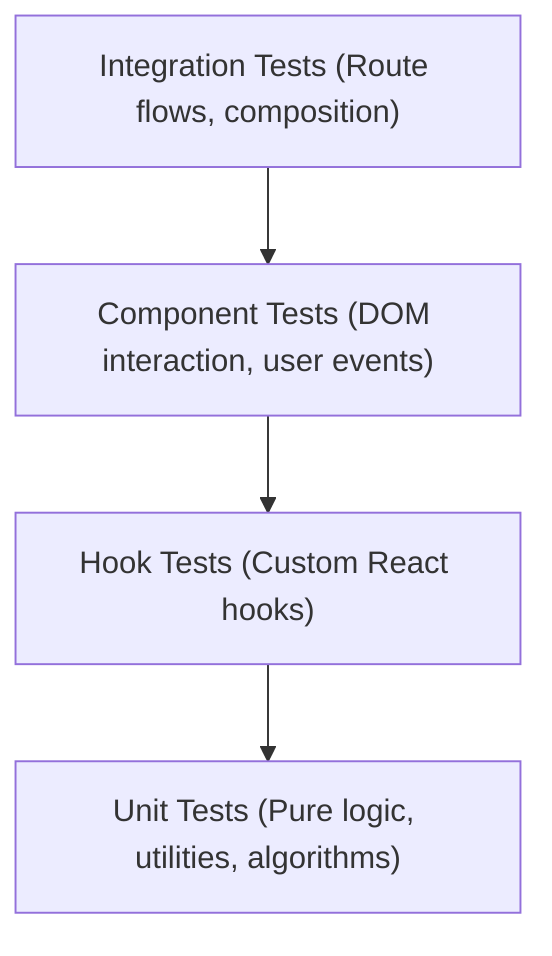

# Protocol: Mandatory Automated Testing Protocol

## 1. Overview & Core Principle
This protocol establishes the mandatory rules of engagement for automated testing across the codebase. 

* **Core Principle:** **Mandatory Test-Accompanied Development**. Every new feature, logic enhancement, or bug fix MUST be accompanied by corresponding automated tests to ensure zero regressions and maintain 100% logic test coverage across business-critical workflows.
* Unaccompanied code changes (features or fixes without tests) are strictly non-compliant and will be rejected at the Code Review and Orchestrator merge gates.

---

## 2. Test Scope & The Testing Pyramid

The testing strategy follows the standard testing pyramid to balance execution speed, isolation, and confidence:

1. **Unit Tests:**
   - **Scope:** Pure algorithmic functions, math utilities, data transformers, validation helpers, and formatting logic.
   - **Focus:** Complete coverage of deterministic outputs, edge cases, boundaries (empty arrays, zero, negative values), and error states.
   - **Examples:** `src/utils/shuffle.ts`, `src/utils/balance.ts`, `src/utils/history.ts`.

2. **Hook Tests:**
   - **Scope:** Custom React business logic hooks encapsulating internal state, effects, and memoized callbacks.
   - **Focus:** State transitions, setter invocations, side-effect triggers, and local storage synchronization using `@testing-library/react`.
   - **Examples:** `src/hooks/useTeamGenerator.ts`, `src/hooks/useTheme.ts`.

3. **Component Tests:**
   - **Scope:** Presentational and interactive React UI components.
   - **Focus:** Render accuracy, conditional styling, DOM accessibility roles, and user interaction simulations via `@testing-library/react` and `@testing-library/user-event`.
   - **Avoid:** Over-testing CSS styles or implementation details; test user-observable behaviors.

4. **Integration Tests:**
   - **Scope:** End-to-end multi-component workflows, router page navigation, and composite feature flows (e.g., inputting players -> generating teams -> inspecting result cards).
   - **Focus:** Component collaboration, route matching, and state continuity across boundaries.

---

## 3. Tooling Standards & Environment

* **Test Runner:** [Vitest](https://vitest.dev/) (`vitest run` or `npm test`). Fast, native ESM support, and Vite-configured aliases (`@/`).
* **DOM & UI Assertions:** `@testing-library/react` and `@testing-library/jest-dom` for testing React components without coupling to internal implementation details.
* **Execution Environment:** `jsdom` (or `node` for pure unit utility suites).
* **Mocking:** Vitest native mocks (`vi.fn()`, `vi.spyOn()`, `vi.mock()`).
* **Language & Assertions:** Standard Vitest BDD API (`describe`, `it`, `expect`).

---

## 4. Quality Gates & Pass Thresholds

All code modifications must pass through mandatory automated quality gates:

1. **Test Suite Pass Rate:**
   - Must execute `npm test` with 100% pass rate (0 failing tests).
   - Zero test skips (`test.skip` or `it.todo`) in production branches without explicit architectural rationale.
2. **Type Safety & Static Analysis:**
   - Zero TypeScript compilation errors (`npm run typecheck` / `tsc --noEmit`).
   - Zero lint errors (`npm run lint` / `eslint src`).
3. **Rejection Criteria:**
   - **Empty Tests:** Tests with no assertions (`expect(...)`) or tests that merely mount without validating state/DOM output.
   - **Superficial Tests:** Tests that do not execute or assert actual business logic or branching paths.
   - **Bypassing Type Safety:** Tests or test utilities utilizing `@ts-ignore`, `@ts-nocheck`, or indiscriminate `any` casts to suppress compile errors.
   - **Tightly Coupled Mocking:** Mocking the unit under test itself rather than its external boundaries.

---

## 5. File Placement Rules

Tests must be organized according to clear, predictable location standards:

* **Adjacent Files:** Test files should live directly alongside the target implementation file using the `.test.ts` or `.test.tsx` suffix:
  - Example: `src/components/common/Button.tsx` -> `src/components/common/Button.test.tsx`
  - Example: `src/hooks/useTheme.ts` -> `src/hooks/useTheme.test.ts`
* **`__tests__` Directory:** Tests for utility packages or group modules may reside in a dedicated `__tests__` subdirectory adjacent to the source modules:
  - Example: `src/utils/shuffle.ts` -> `src/utils/__tests__/shuffle.test.ts`
* **Test Fixtures & Mocks:** Shared mock data and setup helpers should reside in a `__fixtures__` or `__mocks__` directory close to the test suites consuming them.

---

## 6. Multi-Agent Responsibilities & Enforcement

Every agent role in the engineering lifecycle actively enforces this testing protocol:
* **Planner:** Identifies testing requirements and test file deliverables in `1_plan.md`.
* **Architect:** Defines test blueprints, scenarios (happy path, edge cases), and test file targets in `2_architecture.md`.
* **Senior Dev:** Implements tests alongside feature code, runs `npm test`, and documents test results in `3_implementation.md`.
* **Code Reviewer:** Audits diffs for missing or superficial tests, enforces quality thresholds, and rejects untested PRs in `4_review.md`.
* **Document Writer:** Summarizes test suites and pass rates in documentation and PR descriptions (`5_documentation.md`).
* **Orchestrator:** Halts execution and blocks merging if test suites fail or test pass rate is below 100%.
