# Project Overview & Central Orchestration Hub

A scalable Single Page Application (SPA) for Team Generation and Match Tracking, built with **React 19**, **TypeScript**, **Vite**, **Tailwind CSS**, and **Vitest**, alongside a local Supabase backend integration.

This repository utilizes a modular, multi-agent engineering workflow. Root `GEMINI.md` serves as the centralized entry point and policy hub. Detailed specifications for protocols, skills, and specialist agent roles reside in `.agents/`.

---

## 1. Core System Protocols (Mandatory)

All agents, workflows, and tools must strictly adhere to the following core protocols:

* **Dual-Language Boundary Protocol:**
  Engineering communication in English; UI in Bulgarian. ALL internal communication, reasoning, terminal commands, code comments, tests, identifiers, and documentation MUST strictly be in English. The application user interface is localized in Bulgarian for end-users. Premature i18n abstractions are strictly prohibited.
  - Detailed Specification: [.agents/protocols/language.md](file:///D:/Projects/team-generator/.agents/protocols/language.md)

* **Git Workflow & Branching Strategy:**
  Strict `main` -> `dev` -> `feature/fix` hierarchy. Production is `main`. All agent development targets `dev`.
  - Standard Operating Procedure (SOP) before writing code:
    1. `git status`
    2. `git checkout dev`
    3. `git pull origin dev`
    4. `git checkout -b <branch_name>` (e.g., `feature/xxxx` or `fix/xxxx`)
  - Pull Requests MUST target `dev`.
  - Parallel work must use `git worktree add <path> <branch>`.
  - Detailed Specification: [.agents/protocols/git-workflow.md](file:///D:/Projects/team-generator/.agents/protocols/git-workflow.md)

* **Sequential Handoff & Token Optimization Protocol:**
  To eliminate context bleed, optimize token expenditure, and preserve an immutable audit trail, roles communicate strictly via written artifacts saved in `.agent_handoffs/<branch_name>/`.
  - **Single-Hop Delta Handoff:** Agents strictly ingest only the immediate predecessor's artifact, never the entire historical chain.
  - **Artifact Size Ceilings:** Strict token limits (1,500 to 3,000 tokens) are enforced per artifact stage (`0_context.md` through `5_documentation.md`).
  - **Diff-Based Auditing:** Code reviews operate on `git diff` with localized window fallbacks (<= 20 lines) to prevent loading massive source files.
  - **Progressive Disclosure Skills:** Operational runbooks are decoupled into `.agents/skills/` and loaded on demand rather than upfront.
  - Detailed Specification: [.agents/protocols/handoff-protocol.md](file:///D:/Projects/team-generator/.agents/protocols/handoff-protocol.md)

* **Mandatory Automated Testing Protocol:**
  Governs test-driven and test-accompanied development for React/TypeScript to prevent regressions, enforcing the testing pyramid, quality gates, and 100% pass thresholds before merging.
  - Detailed Specification: [.agents/protocols/testing-protocol.md](file:///D:/Projects/team-generator/.agents/protocols/testing-protocol.md)

* **Strict Scoping Rule:**
  No opportunistic refactoring during feature/fix cycles. All PRs must have clean, scoped diffs. Roles must only modify files explicitly required for the current ticket's requirements. Unrelated cleanups, reformatting, or cross-feature refactoring are strictly banned during feature cycles and must be captured as separate tickets.

---

## 2. Tech Stack, Architecture & NPM Scripts

* **Frontend Framework:** React 19 (`react`, `react-dom`)
* **Language:** TypeScript (`tsc --noEmit`)
* **Build & Bundling:** Vite (`npm run dev`, `npm run build`, `npm run preview`)
* **Styling:** Tailwind CSS & PostCSS
* **Testing:** Vitest (`npm test`, 100% test pass rate across shuffle, balance, and history suites)
* **Linting:** ESLint (`npm run lint`)
* **Backend:** Supabase

### Summary of NPM Scripts
* `npm run dev` - Start Vite dev server
* `npm run build` - Build production bundle (`tsc -b && vite build`)
* `npm run preview` - Preview production build locally
* `npm run typecheck` - Run TypeScript type checking (`tsc --noEmit`)
* `npm test` - Run Vitest test suites (`vitest run`)
* `npm run lint` - Run ESLint (`eslint src`)

---

## 3. Agentic Lifecycle, Model Tiering & Roles Directory

The engineering lifecycle follows a sequential chain of specialized roles optimized by compute tiers:

```mermaid
flowchart LR
    User["User Prompt"] --> Orch0["Orchestrator<br/>(0_context.md)"]
    Orch0 --> Plan["Planner<br/>(1_plan.md)"]
    Plan --> Arch["Architect<br/>(2_architecture.md)"]
    Arch --> Dev["Senior Dev<br/>(3_implementation.md)"]
    Dev --> Rev["Code Reviewer<br/>(4_review.md)"]
    Rev -->|Fixes Requested| Dev
    Rev -->|Approved| Doc["Document Writer<br/>(5_documentation.md)"]
    Doc --> OrchFinal["Orchestrator<br/>(PR & User Consent)"]
```



### Model Tiering Policy & Roles Directory
| Role | Model Tier | Responsibility | Specification Link | Output Artifact |
|---|---|---|---|---|
| **Orchestrator** | `pro` / `flash` | Coordination, Git branch setup, handoff initiation, final review | [.agents/roles/orchestrator.md](file:///D:/Projects/team-generator/.agents/roles/orchestrator.md) | `0_context.md` |
| **Planner** | `flash` | Strategic analysis, repo inspection, numbered milestone plan | [.agents/roles/planner.md](file:///D:/Projects/team-generator/.agents/roles/planner.md) | `1_plan.md` |
| **Architect** | `pro` | Technical specifications, schemas, interfaces, file tree blueprint | [.agents/roles/architect.md](file:///D:/Projects/team-generator/.agents/roles/architect.md) | `2_architecture.md` |
| **Senior Dev** | `inherit` / `flash` | Code implementation, test/lint execution, architecture compliance | [.agents/roles/senior-dev.md](file:///D:/Projects/team-generator/.agents/roles/senior-dev.md) | `3_implementation.md` |
| **Code Reviewer** | `flash` | Diff-based audit, compliance checks, defect detection, verdict | [.agents/roles/code-reviewer.md](file:///D:/Projects/team-generator/.agents/roles/code-reviewer.md) | `4_review.md` |
| **Document Writer** | `flash_lite` | Docs management, ADRs (`docs/adr/`), README updates, PR creation targeting `dev` | [.agents/roles/document-writer.md](file:///D:/Projects/team-generator/.agents/roles/document-writer.md) | `5_documentation.md` |
| **Code Health Auditor** | `flash` | Read-only static analysis, technical debt detection, proposal generation (Zero prod edits) | [.agents/roles/code-health-auditor.md](file:///D:/Projects/team-generator/.agents/roles/code-health-auditor.md) | `docs/proposals/code-health-YYYY-MM-DD.md` |

---

## 4. Execution Protocol & User Interaction Guardrails

1. **Initiation:** The **Orchestrator** intercepts the user prompt, verifies environment cleanliness, creates the feature/fix branch from `dev`, initializes `.agent_handoffs/<branch_name>/`, and writes `0_context.md` (ceiling: 1,500 tokens).
2. **Planning:** The Orchestrator summons the **Planner** (`flash`), who consumes `0_context.md` and generates `1_plan.md` (ceiling: 2,000 tokens).
3. **Architecture:** The **Architect** (`pro`) consumes `1_plan.md` and designs technical contracts in `2_architecture.md` (ceiling: 3,000 tokens).
4. **Implementation:** The **Senior Dev** (`inherit`/`flash`) consumes `2_architecture.md`, delivers conforming code, runs verification, and logs changes in `3_implementation.md` (ceiling: 2,500 tokens).
5. **Review:** The **Code Reviewer** (`flash`) consumes `3_implementation.md`, conducts a diff-based audit (`git diff`), and outputs `4_review.md` (ceiling: 1,500 tokens). If fixes are requested, control returns to Senior Dev.
6. **Documentation & PR:** Upon approval, the **Document Writer** (`flash_lite`) consumes `4_review.md`, drafts docs/ADRs (`docs/adr/0003-tech-stack-selection.md`), creates `5_documentation.md` (ceiling: 2,000 tokens), and opens a PR targeting `dev`.
7. **Hard Stop for Consent:** The Orchestrator presents the completed PR and execution summary to the user. The Orchestrator **MUST halt execution and request explicit user permission before merging** or proceeding if a critical blocker is found.

### On-Demand Code Health Audit Workflow
- **Manual Trigger Only:** The `code-health-auditor` operates independently outside the standard linear feature lifecycle. It must never be triggered automatically during feature runs.
- **Invocation Pattern:**
  ```text
  @code-health-auditor Run a code health audit on the [directory/module/project] focusing on [all/specific focus area]. Generate a proposal in docs/proposals/.
  ```
- **Proposal-to-Ticket Conversion:**
  1. User reviews `docs/proposals/code-health-YYYY-MM-DD.md`.
  2. User selects desired refactoring/cleanup actions.
  3. User/Orchestrator creates dedicated `refactor/<name>` or `chore/<name>` branches/tickets.
  4. Senior Dev executes the isolated ticket with standard test suites and scoping.
