```mermaid
flowchart LR
    User["User Prompt"] --> Orch0["Orchestrator<br/>(0_context.md)"]
    Orch0 --> Plan["Planner<br/>(1_plan.md)"]
    Plan --> Arch["Architect<br/>(2_architecture.md)"]
    Arch --> Dev["Senior Dev<br/>(3_implementation.md)"]
    Dev --> Rev["Code Reviewer<br/>(4_review.md)"]
    Rev -->|Fixes Requested| Dev
    Rev -->|Approved| Doc["Document Writer<br/>(5_documentation.md)"]
    Doc --> OrchFinal["Orchestrator<br/>(PR & User Consent)"]
```

# Project Overview & Central Orchestration Hub

A scalable Single Page Application (SPA) for Team Generation and Match Tracking. The project is organized around a modular architecture with a local Supabase backend (requires Docker).

This repository utilizes a modular, multi-agent engineering workflow. Root `GEMINI.md` serves as the centralized entry point and policy hub. Detailed specifications for protocols and specialist agent roles reside in `.agents/`.

---

## 1. Core System Protocols (Mandatory)

All agents, workflows, and tools must strictly adhere to the following core protocols:

* **Universal English Language Rule:**
  ALL communication, internal reasoning, terminal commands, code comments, documentation, and user-agent interactions MUST strictly be in English. The agent must never use Bulgarian or any other language, even when prompted by the user.
  - Detailed Specification: [.agents/protocols/language.md](file:///D:/Projects/team-generator/.agents/protocols/language.md)

* **Git Workflow & Branching Strategy:**
  Strict `main` -> `dev` -> `feature/fix` hierarchy. Production is `main`. All agent development targets `dev`.
  - Standard Operating Procedure (SOP) before writing code:
    1. `git status`
    2. `git checkout dev`
    3. `git pull origin dev`
    4. `git checkout -b <branch_name>` (e.g., `feature/xxxx` or `fix/xxxx`)
  - Pull Requests MUST target `dev`.
  - Parallel work must use `git worktree add <path> <branch>`.
  - Detailed Specification: [.agents/protocols/git-workflow.md](file:///D:/Projects/team-generator/.agents/protocols/git-workflow.md)

* **Sequential Handoff Protocol:**
  To eliminate context bleed and preserve an immutable audit trail, roles communicate strictly via written artifacts saved in `.agent_handoffs/<branch_name>/`.
  - Each role reads the artifact of the previous role, produces its designated artifact, and passes control.
  - Handoff folders are retained for history until the user explicitly commands their deletion after a successful merge.
  - Detailed Specification: [.agents/protocols/handoff-protocol.md](file:///D:/Projects/team-generator/.agents/protocols/handoff-protocol.md)

---

## 2. Agentic Lifecycle & Roles Directory

The engineering lifecycle follows a sequential chain of specialized roles:

### Roles Directory
| Role | Responsibility | Specification Link | Output Artifact |
|---|---|---|---|
| **Orchestrator** | Coordination, Git branch setup, handoff initiation, final review | [.agents/roles/orchestrator.md](file:///D:/Projects/team-generator/.agents/roles/orchestrator.md) | `0_context.md` |
| **Planner** | Strategic analysis, repo inspection, numbered milestone plan | [.agents/roles/planner.md](file:///D:/Projects/team-generator/.agents/roles/planner.md) | `1_plan.md` |
| **Architect** | Technical specifications, schemas, interfaces, file tree blueprint | [.agents/roles/architect.md](file:///D:/Projects/team-generator/.agents/roles/architect.md) | `2_architecture.md` |
| **Senior Dev** | Code implementation, test/lint execution, architecture compliance | [.agents/roles/senior-dev.md](file:///D:/Projects/team-generator/.agents/roles/senior-dev.md) | `3_implementation.md` |
| **Code Reviewer** | Independent audit, compliance checks, defect detection, verdict | [.agents/roles/code-reviewer.md](file:///D:/Projects/team-generator/.agents/roles/code-reviewer.md) | `4_review.md` |
| **Document Writer** | Docs management, ADRs (`docs/adr/`), README updates, PR creation targeting `dev` | [.agents/roles/document-writer.md](file:///D:/Projects/team-generator/.agents/roles/document-writer.md) | `5_documentation.md` |

---

## 3. Execution Protocol & User Interaction Guardrails

1. **Initiation:** The **Orchestrator** intercepts the user prompt, verifies environment cleanliness, creates the feature/fix branch from `dev`, initializes `.agent_handoffs/<branch_name>/`, and writes `0_context.md`.
2. **Planning:** The Orchestrator summons the **Planner**, who creates `1_plan.md`.
3. **Architecture:** The **Architect** designs the technical contracts in `2_architecture.md`.
4. **Implementation:** The **Senior Dev** delivers code conforming 100% to specifications and logs output in `3_implementation.md`.
5. **Review:** The **Code Reviewer** validates the changes against the architecture and protocols, outputting `4_review.md`. If fixes are requested, control returns to Senior Dev.
6. **Documentation & PR:** Upon approval, the **Document Writer** drafts docs/ADRs, creates `5_documentation.md`, and opens a PR targeting `dev`.
7. **Hard Stop for Consent:** The Orchestrator presents the completed PR and execution summary to the user. The Orchestrator **MUST halt execution and request explicit user permission before merging** or proceeding if a critical blocker is found.
